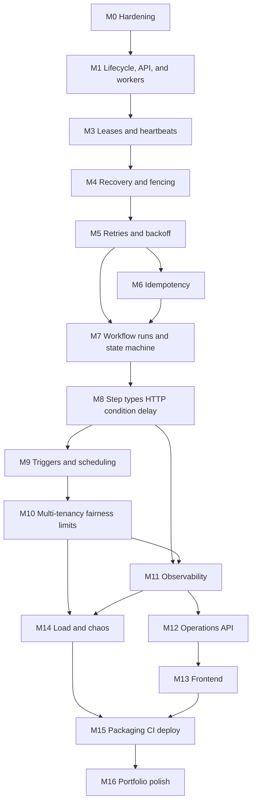

# Durable Workflow Engine: Roadmap from Current State to Resume-Ready

This roadmap was written on 2026-10-02 from a read of the repo at that time: `pom.xml`, `application.yaml`, both Flyway migrations, `Task`, `TaskRepository`, `TaskService`, `TaskController`, `TaskWorker`, both test classes, `README.md`, `PROJECT_CONTEXT.md`, and the surefire reports. Git history was not analyzed.

**How agents should use this file:** implement ONE milestone at a time (M0, M1, ...). Re-inspect the repository first, since it is the source of truth and may have moved past section 0. Follow the milestone's "Definition of done" and the architecture decisions in section 1, and respect the "do NOT build" list in section 2. Follow the AI Development Rule in `PROJECT_CONTEXT.md` (explain architectural changes before making them).

**Update (M1.0, 2026-10-05):** M0 is complete, including GitHub Actions (`.github/workflows/ci.yml` runs `./mvnw verify` with a 20-minute job timeout). Roadmap M2 is merged into M1. Deviations from the original M1-M4 text are in the table under M1, and the lifecycle model is ADR 0004. Section 0 below is the 2026-10-02 audit, not the current tree.

**Update (M1.2, 2026-10-05):** M1.1 (`TaskStatus`, `Task`, Flyway V4) and M1.2 (guarded complete, fail, and cancel) are implemented. The worker runtime and the versioned API are not.

---

## 0. Where the repo actually is today

### Already complete (verified in code)

- **Spring Boot 4.1.1 / Java 25 / Maven** project with actuator (health, info only), validation, webmvc, JDBC, Flyway, the PostgreSQL driver, and Testcontainers test dependencies.
- **Layering:** `TaskController` → `TaskService` → `TaskRepository` (`JdbcClient`) → PostgreSQL.
- **Schema:** `V1__create_tasks_table.sql` creates `tasks(id uuid pk default gen_random_uuid(), status text, payload jsonb, created_at timestamp, claimed_at timestamp, worker_id uuid)`. `V2__fix_claimed_at_default.sql` drops the default on `claimed_at`.
- **Create:** `POST /tasks` inserts a `PENDING` task and returns the UUID.
- **Atomic claim:** `TaskRepository.claimTask` uses a CTE with `FOR UPDATE SKIP LOCKED` plus `UPDATE ... RETURNING`. `TaskService.claimTask` is `@Transactional`.
- **Concurrency integration test:** `ConcurrentTaskClaimTest` uses Testcontainers `postgres:16-alpine`, a `CyclicBarrier`, 20 tasks, 20 and 24 workers, and 10 rounds. It asserts uniqueness, exhaustiveness, surplus workers getting nothing, and persisted `RUNNING`/`worker_id`/`claimed_at`. Its Javadoc honestly states it does not prove `SKIP LOCKED` versus a blocking lock.
- The surefire reports show both test classes passing.

### Gaps and issues found in the repo (to fix in M0 and M1)

1. **`DurableWorkflowEngineApplicationTests`** has no Testcontainers. It uses `application.yaml` (`localhost:5432`), so it only passes when your local Docker Postgres is running. It would fail in CI.
2. **No `docker-compose.yml`**, although the README mentions Docker and a planned compose file. DB credentials are hardcoded in `application.yaml`.
3. **Schema weaknesses:**
   - `timestamp` (without time zone) instead of `timestamptz`.
   - `status` is free text with no `CHECK` constraint.
   - No index supporting the claim query (`status`, `created_at`).
   - No `updated_at`.
   - `claimed_at` has the nullable and default history.
4. **Domain model:** `Task.status` is a `String`, timestamps are `LocalDateTime`. No `TaskStatus` enum and no transition rules.
5. **Missing lifecycle operations:** there is no complete or fail operation. `COMPLETED`/`FAILED` exist only in docs. A claimed task is stuck `RUNNING` forever.
6. **Controller:**
   - `POST /tasks` takes a raw `String` body with no validation, so malformed JSON is only caught by the DB cast.
   - It returns a bare UUID with no `201` or `Location`.
   - `/tasks/claim` is a test endpoint using a random worker id, with a `consumes = {}` workaround.
   - There is no `GET`, no error model, and no exception handling.
7. **`TaskWorker`** is a `System.out.println` placeholder.
8. **Tests:**
   - The container is declared per test class (no shared singleton).
   - There are no unit tests, no web-layer tests, and no deterministic "skip locked" proof.
9. **Docs are stale:** `PROJECT_CONTEXT.md` still lists "Concurrent worker test" unchecked, and the README lists JUnit/Testcontainers as "planned". The `pom.xml` metadata (`name`, `description`, license, developers, scm) is empty placeholders.
10. **No CI**, no `.github`, no Dockerfile, no `docs/` folder.
11. **Package name `durable_workflow_engine`** uses underscores, which is unconventional in Java. It is cheap to rename now (about 8 files) and awkward later. I recommend `com.kushal.workflow` to match the existing groupId (a decision to confirm before M0).

### Not started

Worker runtime, leases, heartbeats, recovery, fencing, retries, backoff, idempotency, workflow definitions and runs, step types, scheduling, multi-tenancy, fairness, rate limiting, backpressure, observability, API polish, frontend, load and chaos testing, deployment, portfolio polish.

---

## 1. Key architecture decisions (made once, up front)

These keep later milestones coherent. Record each as a short ADR in `docs/adr/` during M0.

1. **`tasks` is the generic execution queue; workflows sit on top.** Existing work is preserved. Later, `tasks` gains `run_id`, `step_key`, and `task_type`. A workflow step is executed as a task. The queue layer (claim, lease, fence, retry) knows nothing about workflows.
2. **PostgreSQL is the only infrastructure for the whole core.** The database is the source of truth, the queue, the scheduler, and the lock manager. No Redis or Kafka in the core.
3. **Fencing token = `attempt` counter.** `attempt` is incremented only on claim. Every state-changing write is guarded by `WHERE id=? AND status='RUNNING' AND worker_id=? AND attempt=?`. If zero rows are updated, the caller is stale.
4. **The database clock is the only clock for leases.** Use `now()`/`clock_timestamp()` in SQL, never the JVM clock, so worker clock skew cannot break lease logic.
5. **Never hold a transaction or DB connection while executing user logic.** The pattern is: claim (short tx) → execute (no tx) → complete (short tx).
6. **Guarantee statement (goes in the README once recovery and idempotency exist):** at-least-once execution, with stale-worker writes rejected, and effectively-once results through idempotency keys. It will not claim exactly-once. M1 must not put this sentence in the README. M1's honest guarantees are the narrower list in ADR 0004 (a crash leaves the task `RUNNING`; at-least-once is M4).
7. **One deployable, role-switchable.** A modular monolith with a config switch (`engine.role=api|worker|all`) lets the same jar scale API and workers separately. No microservices.
8. **Status vocabulary:** `PENDING`, `RUNNING`, `COMPLETED`, `FAILED` (terminal after retries, which is the dead-letter state), `CANCELLED`. A retry is `RUNNING → PENDING` with `available_at` in the future. Status is stored as text with a `CHECK` constraint and mirrored by a Java enum.

---

## 2. Technology classification

### A. CORE (required to call the project complete)

- Java/Spring Boot, JdbcClient, PostgreSQL, Flyway, Maven
- JUnit 5, Testcontainers, Awaitility (test-only, for polling assertions)
- Docker and Docker Compose
- Micrometer + Prometheus endpoint and structured JSON logs
- GitHub Actions CI
- JDK `java.net.http.HttpClient` for HTTP steps (no new dependency)
- Spring's built-in `CronExpression` for cron triggers (no Quartz)
- A WireMock (or JDK `HttpServer`) test dependency to fake downstream services
- springdoc OpenAPI (docs, and client generation for the UI)

### B. IMPORTANT EXTENSIONS (after the core works)

- React + TypeScript dashboard (four screens)
- Grafana dashboard provisioned in compose
- OpenTelemetry tracing (via Micrometer Tracing bridge)
- Postgres `LISTEN/NOTIFY` to wake idle workers (latency optimization)
- Wait-for-external-signal step (resume via API)
- Parallel fan-out/join steps
- Load and chaos test harness (k6 or a Java load generator)
- Deploying compose to a single cloud VM
- Retention/cleanup job for old tasks

### C. STRETCH / OPTIONAL (only with a clear technical reason)

- Terraform for the single VM
- Postgres row-level security for tenant isolation
- Saga/compensation steps
- SSE for live UI updates
- Priority queues
- Toxiproxy network-fault tests
- Workflow definition versioning UI
- Secrets management for HTTP step credentials

### Explicitly do NOT build unless a concrete problem forces it

- **Redis** (rate limiting in Postgres is fine at this scale; revisit only if benchmarks show the DB is the bottleneck).
- **Kafka** (nothing in this system needs a log; an outbox table is enough).
- **Kubernetes, service mesh, Helm.**
- **Microservices split** (one jar, role-switched).
- **Quartz, Temporal, Camunda, Spring Batch** (they would replace the learning).
- **JavaScript or SpEL expression evaluation** in conditions (security risk).
- **GraphQL, WebSockets, Spring Cloud.**
- **Event sourcing as the storage model.** A simple append-only events table for history is enough.
- **A visual drag-and-drop workflow builder.**
- **Multi-region or sharded Postgres.**

---

## 3. Dependency graph



Notes: M11 can start after M8 (basic metrics) and be completed after M10. M13 can start any time after M12. M0, then M1 (former M2 included), then M3 through M6 are strictly sequential. Roadmap M2 is not a separate milestone.

---

## 4. Time and complexity summary

Estimates assume one person at 10-15 hours/week with AI assistance. They include learning time, reading and understanding generated code, and writing tests (the slowest part).

- M0 Hardening: Small, 1 week
- M1 Task lifecycle, API, and worker runtime (M2 merged here): Medium, about 2.5-3.5 weeks (the original 1-1.5 plus 1.5-2)
- M2: merged into M1; do not schedule it separately
- M3 Leases and heartbeats: Medium, 1.5-2 weeks
- M4 Crash recovery and fencing: Large, 2-3 weeks
- M5 Retries, backoff, dead letter: Medium, 1.5-2 weeks
- M6 Idempotency: Medium, 2 weeks
- M7 Workflow definitions, runs, state machine: Large, 2-3 weeks
- M8 Step types (HTTP, condition, delay): Large, 2-3 weeks
- M9 Triggers and scheduling: Medium, 1.5-2 weeks
- M10 Multi-tenancy, fairness, rate limiting, backpressure: Very Large, 3-5 weeks
- M11 Observability: Medium, 1.5-2 weeks
- M12 Operations API: Medium, 1-2 weeks
- M13 Frontend: Large, 3-4 weeks
- M14 Load and chaos testing: Medium, 1.5-2 weeks
- M15 Packaging, CI/CD, deployment: Medium, 2 weeks
- M16 Portfolio polish: Small, 1 week

**Totals:** full roadmap about 30-40 weeks (7-9 months). The minimum resume-ready version (see section 6) is about 18-23 weeks.

---

# PHASE 1: Core execution engine

---

## M0. Foundation hardening and housekeeping

**Complexity:** Small. **Time:** about 1 week. **Depends on:** nothing.

**Goal**
- Make the current base solid, reproducible, and CI-ready before adding behavior.
- Fix the gaps found in the audit so every later milestone builds on tested, reproducible ground.

**Concepts to understand first**
- `timestamp` vs `timestamptz`. Why storing instants without a zone is a bug, and why Java `Instant`/`OffsetDateTime` maps to `timestamptz`.
- Flyway immutability. Never edit an applied migration; add a new one.
- Why a partial index on `WHERE status='PENDING'` makes the claim query fast.
- Testcontainers singleton-container pattern (one container reused across test classes) and why tests should not depend on a developer's local DB.
- What `SKIP LOCKED` actually does versus waiting. Your own test Javadoc admits this gap, so this milestone closes it.

**Implementation tasks**
- Decide and (if approved) rename the package `durable_workflow_engine` → `com.kushal.workflow` (IDE refactor; update the main class and tests).
- Create an abstract `PostgresIntegrationTest` base class in `src/test/java/.../support/` with a singleton `PostgreSQLContainer` and `@ServiceConnection`. Make `ConcurrentTaskClaimTest` and the context test extend it.
- Add `V3__task_hardening.sql` (see Database).
- Add a deterministic skip-locked test: open a transaction on connection A that `SELECT ... FOR UPDATE` locks task 1; on connection B call `claimTask` and assert it returns task 2 immediately (with a short timeout), or null if only task 1 exists. This proves "skip" rather than "wait".
- Add `docker-compose.yml` with Postgres 16 and a named volume; move credentials to env vars with defaults in `application.yaml` (`${DB_URL:...}`).
- Add `.github/workflows/ci.yml` running `./mvnw verify` on Java 25 (Testcontainers works on GitHub-hosted runners).
- Fill in `pom.xml` metadata or remove empty placeholders.
- Update `README.md` and `PROJECT_CONTEXT.md` so checkboxes reflect reality. Create `docs/adr/0001-postgres-as-queue.md`, `0002-at-least-once.md`, `0003-fencing-via-attempt.md`.
- Add `.gitattributes`/line-ending check so Windows and CI agree.

**Database changes**
- `V3`: convert `created_at` and `claimed_at` to `timestamptz` (`ALTER COLUMN ... TYPE timestamptz USING ... AT TIME ZONE 'UTC'`).
- Add `updated_at timestamptz not null default now()`.
- `CHECK (status IN ('PENDING','RUNNING','COMPLETED','FAILED','CANCELLED'))`.
- `CREATE INDEX idx_tasks_pending ON tasks (created_at) WHERE status = 'PENDING';`
- Update `Task` to use `Instant`.

**API changes:** none.

**Testing strategy**
- Existing concurrency tests still pass after migration.
- New deterministic skip-locked test.
- A migration test: the context loads against a fresh container (Flyway runs V1 → V3).
- CI runs everything green from a clean checkout.

**Failure modes**
- Migration fails on non-empty local DB. Mitigation: test the migration against a DB with pre-existing rows.
- CI flakiness from Docker availability. Use the singleton container and generous timeouts.

**Definition of done**
- `./mvnw verify` passes on a clean machine with Docker but without your local Postgres.
- CI is green.
- Deterministic skip-locked test exists and was verified to fail if `SKIP LOCKED` is removed.
- Docs reflect reality.

**Interview/resume value:** disciplined schema evolution, reproducible environments, and testing that proves a mechanism instead of hoping for it.

---

## M1. Task lifecycle, API, and worker runtime

**Complexity:** Medium. **Time:** original M1 (1-1.5 weeks) plus former M2 (1.5-2 weeks), implemented as M1.0-M1.6. **Depends on:** M0.

Roadmap **M2 is merged into this milestone**. M3 and later keep their numbers. Where the original bullets below disagree with the deviations table or with ADR 0004, those win. M1.0 records the decisions only; it does not implement them.

**Goal**
- Complete the task state machine: a task can finish successfully or fail, and clients can observe it.
- Run that work on a bounded worker pool: claim, execute with no connection held, then one finish write.
- Replace the test-only API with a real, validated REST API.

### Recorded deviations (M1.0)

These replace the original roadmap text where they conflict. ADR 0004 is the decision record.

| Roadmap says | M1 does | Why |
| --- | --- | --- |
| Separate M1 then M2 | Merged into this M1 | The executor needs complete/fail, and the API needs a worker to be demoable |
| `completed_at` | `finished_at` | `FAILED` and `CANCELLED` also need a terminal time |
| Cancel already-`CANCELLED` → `409` | `200` (idempotent) | Safer for clients; still `409` for `RUNNING` or another terminal status |
| Offset list pagination | No list endpoint in minimum M1 | Keyset pagination is M12 |
| Process-level `workerId` plus per-loop id | Per-loop UUID only | One loop, one thread, one id; fencing later uses `attempt`, not a process id |
| Enforce a handler timeout (M2) | No timeout | Java cannot kill a thread; timeout → `FAILED` while the handler still runs would be a lie. Leases and a cancel signal are M3 |
| Pool-starvation test / Hikari fail-fast | Document `pool ≥ concurrency + API headroom` | No connection is held during execute, so that starvation scenario does not apply |
| `canTransitionTo` table | Deleted | One parametrized database test is the spec |
| Throw `StaleClaimException` on zero rows (worker path) | Zero rows is a value | Matches ADR 0003 |
| M4 reaper clears `worker_id` and `lease_expires_at` only | Reaper must also clear `claimed_at` | `tasks_pending_has_no_owner_check` |
| M3 adds another RUNNING-has-owner CHECK | M3 **replaces** `tasks_running_has_owner_check` | Avoid two overlapping constraints |
| `result`/`error` exclusivity CHECKs | Not in V4 | They block M5/M8 (`last_error`, a `FAILED` HTTP response body) |

**Concepts to understand first**
- State machines. Legal transitions are an invariant enforced in the database `WHERE` clause, not just in Java.
- Compare-and-set updates: `UPDATE ... WHERE status='RUNNING' AND worker_id=:w` and checking the row count.
- REST semantics: `201 Created` with `Location`, `404`, `409` for illegal transitions, `422/400` for validation, RFC 9457 `ProblemDetail` errors.
- DTOs vs. domain records. Never expose internal rows directly.
- Why `jsonb` payloads should be validated as JSON at the edge.

**Implementation tasks**
- `TaskStatus` enum with `isTerminal()` only. No `canTransitionTo` table. One parametrized database test is the transition spec.
- `TaskRepository`: complete and fail as guarded `UPDATE ... RETURNING` statements; `findById`. No list query in minimum M1.
- `TaskService`: complete and fail. On the worker path, zero rows is a value (applied, already applied, or rejected), not a thrown `StaleClaimException`. Do not retry a zero-row update. Keep `claimTask`.
- DTOs: `CreateTaskRequest(taskType, payload)` (payload as `JsonNode`), `TaskResponse`.
- `TaskController`: `POST /api/v1/tasks` → `201` + `Location`; `GET /api/v1/tasks/{id}`; `GET /api/v1/tasks?status=`; `POST /tasks/{id}/cancel`.
- `GlobalExceptionHandler` (`@RestControllerAdvice`) returning `ProblemDetail`.
- Remove `POST /tasks/claim`. Workers call the service directly. Do not keep an HTTP claim endpoint.
- Add `task_type` in V4 (format-checked). Existing rows backfill to `NOOP`, then the column default is dropped.

**Database changes**
- `V4`: `task_type text` (temporary default `NOOP` for the backfill, then drop it), `finished_at timestamptz`, `result jsonb`, `error text`.
- Named checks: `finished_at` is set if and only if the status is terminal (`COMPLETED`, `FAILED`, or `CANCELLED`); `RUNNING` has `worker_id` and `claimed_at`; `PENDING` has neither; `task_type` matches `^[A-Z][A-Z0-9_]{0,63}$`.
- No `result`/`error` exclusivity checks. They would block `last_error` (M5) and a `FAILED` row that still stores an HTTP response body (M8).

**API changes**
- `POST /api/v1/tasks` → `201 Created`, body `TaskResponse`, `Location: /api/v1/tasks/{id}`.
- `GET /api/v1/tasks/{id}` → `200` or `404`.
- No list endpoint in minimum M1. Keyset pagination stays in M12.
- `POST /api/v1/tasks/{id}/cancel` → `200` if `PENDING` or already `CANCELLED`; `409` if `RUNNING` or another terminal status; `404` if missing.
- Invalid JSON/unknown type → `400` with a `ProblemDetail`.

**Testing strategy**
- DTO validation. No transition-table unit test.
- Repository integration: complete only succeeds for the owning worker while `RUNNING`; second complete is a no-op/stale; complete on `PENDING` fails.
- `@WebMvcTest` for controller status codes and error bodies.
- Concurrency: two workers racing to complete the same task, so exactly one wins.
- Invariant: terminal states are absorbing because each statement's `WHERE` requires the pre-state, not because a `CHECK` can see the previous status.

**Failure modes**
- Worker completes a task it no longer owns → rejected (`409`), not silently applied.
- Cancel racing with claim → exactly one wins, decided by row lock/`WHERE` guard.
- Malformed payload → `400`, never a DB error leaking as `500`.

**Definition of done**
- A task can be created, claimed by a worker loop, executed, and completed or failed.
- Illegal transitions are rejected by the SQL `WHERE` clause and covered by one parametrized database test.
- `POST /tasks/claim` is gone.
- Cancel of a pending or already-cancelled task returns 200; cancel of a running or other terminal task returns 409.
- No list endpoint is required.
- Graceful shutdown is tested: no new claims after stop, and a handler still running at the deadline stays `RUNNING`.
- Docs state the ADR 0004 guarantees, including the limitation that a crash, an interrupt, or a failed finish write leaves the task `RUNNING`.

**Interview/resume value:** state-machine invariants enforced at the data layer; compare-and-set; clean REST error handling.

---

## M2. Real worker runtime (merged into M1)

**Status:** merged into M1 (recorded M1.0, 2026-10-05). Do not implement M2 as its own milestone. M3 and later keep their numbers.

The worker pool ships with the lifecycle and the REST API. The original goal still applies, as part of M1: a background pool that claims, executes, and finishes tasks, shuts down without claiming new work, and documents that a crash leaves the task `RUNNING`. ADR 0004 is the spec. The deviations table under M1 replaces the original M2 text, including:

- One UUID per loop for that loop's lifetime. No separate process-level `workerId`.
- No handler timeout, and no standalone `TaskHandlerRegistry`.
- No pool-starvation test and no Hikari fail-fast bean. Document `maximum-pool-size` ≥ concurrency + API headroom.
- Do not add Awaitility for this work.

**Interview/resume value:** worker pools, backpressure by pull, connection-pool awareness, graceful shutdown.

---

# PHASE 2: Reliability and distributed-systems features

---

## M3. Leases and heartbeats

**Complexity:** Medium. **Time:** 1.5-2 weeks. **Depends on:** M1 (the worker runtime is part of M1).

**Goal**
- A claim becomes a time-limited lease rather than a permanent ownership claim.
- Workers extend the lease via heartbeats while working.
- This is the prerequisite for detecting dead workers.

**Concepts to understand first**
- Leases vs locks: a lease expires automatically, so a dead owner cannot block progress forever.
- Heartbeat interval vs lease duration (rule of thumb: heartbeat every lease/3).
- Why you cannot distinguish "slow" from "dead" in a distributed system. This is why fencing (M4) exists.
- DB time vs app time; GC pauses and clock skew.
- `now()` (transaction start) vs `clock_timestamp()`.

**Implementation tasks**
- Update `claimTask` to set `lease_expires_at = now() + :leaseSeconds` and `attempt = attempt + 1`.
- `TaskRepository.extendLease(taskId, workerId, attempt, leaseSeconds)`: a guarded update returning a boolean.
- Worker heartbeat: a scheduled task per in-flight task (or a shared scheduler) that extends the lease; if extension returns false, signal the handler to abort (cooperative cancellation via the `TaskContext`).
- Config: `engine.lease.duration`, `engine.lease.heartbeat-interval`.
- Guard `markCompleted`/`markFailed` with `attempt` and `lease_expires_at > now()` is NOT required yet (that is M4); keep the attempt guard.

**Database changes**
- `V5`: `lease_expires_at timestamptz`, `attempt int not null default 0`, `last_heartbeat_at timestamptz`.
- `CREATE INDEX idx_tasks_running_lease ON tasks (lease_expires_at) WHERE status = 'RUNNING';`
- Replace `tasks_running_has_owner_check` (added in M1: `RUNNING` requires `worker_id` and `claimed_at`) with one check that also requires `lease_expires_at`. Do not add a second overlapping RUNNING-has-owner check.

**API changes:** the task response gains `attempt`, `leaseExpiresAt`, `workerId`.

**Testing strategy**
- Unit: heartbeat scheduler extends at the right cadence (fake scheduler).
- Integration: a long task (3x lease) with heartbeats keeps `RUNNING` and the lease keeps moving forward.
- A heartbeat from the wrong worker or wrong attempt is rejected.
- A handler that ignores heartbeats lets its lease expire (verified in the DB; recovery is M4).
- Invariant: every `RUNNING` row has a non-null future-or-expired lease; `attempt` strictly increases on each claim.

**Failure modes**
- Heartbeat thread starved or paused (GC) → lease expires while the worker is alive (a zombie). M4 handles this.
- DB blip during heartbeat → retry heartbeat within the remaining lease; abort the handler if the lease is lost.
- Lease too short vs. too long: trade-off between recovery speed and false positives (document it).

**Definition of done:** leases are set, extended, and observable; guards reject wrong worker/attempt; the documented lease-duration trade-off exists.

**Interview/resume value:** leases, heartbeats, and the slow-vs-dead problem.

---

## M4. Crash recovery and fencing

**Complexity:** Large. **Time:** 2-3 weeks. **Depends on:** M3.

**Goal**
- Tasks held by dead workers return to the queue automatically.
- A "zombie" worker that wakes up after losing its lease cannot corrupt state.

**Concepts to understand first**
- At-least-once delivery: recovering a possibly-still-running task means it may execute twice.
- Fencing tokens (Kleppmann's "How to do distributed locking"): a monotonic token checked by the resource at write time.
- Why the token must be checked by the data store in the same statement as the write.
- Safe multi-reaper design: `SKIP LOCKED` makes concurrent reapers safe without leader election.
- Alternative design: reclaim expired leases inside the claim query ("lazy reclaim"). Record the chosen approach in an ADR. Recommended: an explicit reaper, because it gives visibility and metrics.

**Implementation tasks**
- `LeaseReaper` (`@Scheduled`, or its own loop) running `UPDATE tasks SET status='PENDING', worker_id=NULL, claimed_at=NULL, lease_expires_at=NULL ... WHERE id IN (SELECT id FROM tasks WHERE status='RUNNING' AND lease_expires_at < now() ORDER BY lease_expires_at LIMIT :batch FOR UPDATE SKIP LOCKED) RETURNING id`. M1's `tasks_pending_has_no_owner_check` requires a `PENDING` row to have a null `claimed_at`, so the reaper must clear `claimed_at` as well as `worker_id` and `lease_expires_at`.
- Make sure every completion/failure/extension carries `attempt` in the `WHERE` clause (the fencing guard), so a stale worker's write affects 0 rows.
- Worker handles "0 rows updated" as `LeaseLostException`: log, discard the result, and do not retry the write.
- Record each reclaim in a `task_attempts` row (see below).
- Config: `engine.reaper.interval`, `batch-size`.
- Test hooks: a `FaultInjection` helper in test code to pause or kill a worker's heartbeats/threads.

**Database changes**
- `V6`: `task_attempts(id bigserial pk, task_id uuid references tasks, attempt int, worker_id uuid, started_at, ended_at, outcome text check in ('COMPLETED','FAILED','LEASE_EXPIRED','CANCELLED'), error text)`, unique on `(task_id, attempt)`.
- Index on `task_attempts(task_id)`.
- Write to `task_attempts` inside the same transaction as the state change.

**API changes:** `GET /api/v1/tasks/{id}/attempts` returns attempt history.

**Testing strategy**
- Crash test: start a worker, claim a task, kill its threads without releasing (simulated crash), wait for the lease to expire, and assert another worker completes the task and `attempt = 2`.
- Zombie test: worker A claims, is paused past lease expiry (latch), the reaper requeues, worker B completes; A resumes and tries to complete, so it must affect 0 rows and the final result must be B's.
- Concurrent reapers: run 3 reapers over 1,000 expired tasks, so each is requeued exactly once.
- Soak/property test: random worker deaths over a randomized schedule; at the end assert every task is `COMPLETED`, with each `attempt >= 1`.
- Invariants: no task is `COMPLETED` by a worker whose `attempt` is not the final attempt; there is never more than one `RUNNING` owner per task.

**Failure modes**
- Reaper dies → tasks wait until another reaper runs (all instances run one; harmless duplicates).
- Reaper requeues a task whose worker is merely slow → the task may run twice (this is the at-least-once guarantee). The stale write is rejected.
- Side effects done by the zombie are NOT undone (this motivates M6).

**Definition of done:** crash and zombie tests pass repeatedly; ADR documents the guarantee and its limits; no completion by a stale attempt is possible.

**Interview/resume value:** crash recovery, fencing tokens, lease-based failure detection, at-least-once reasoning. This is the centerpiece of the project.

---

## M5. Retries, exponential backoff, and dead-lettering

**Complexity:** Medium. **Time:** 1.5-2 weeks. **Depends on:** M4.

**Goal**
- Failed attempts are retried with increasing delays, up to a limit.
- Permanently failing tasks end in a terminal, inspectable state.

**Concepts to understand first**
- Exponential backoff with jitter (full jitter) and why synchronized retries cause thundering herds.
- Retryable vs non-retryable errors (e.g., 5xx/timeouts vs 4xx/validation).
- Dead-letter queues and poison messages.
- Delayed visibility: a task is not claimable until `available_at <= now()`.
- Whether lease expiries count as attempts (yes; they bound crash loops).

**Implementation tasks**
- `RetryPolicy` value object (`maxAttempts`, `baseDelay`, `multiplier`, `maxDelay`, jitter), unit-tested with a seeded random source.
- Handler outcome model: `Success`, `RetryableFailure`, `PermanentFailure`.
- `TaskService.failAttempt(...)`: if retryable and `attempt < max_attempts`, set `PENDING` with `available_at = now() + delay`; else set `FAILED`.
- Reaper uses the same policy when a lease expires.
- Update the claim query: `WHERE status='PENDING' AND available_at <= now() ORDER BY available_at, created_at`.
- `POST /api/v1/tasks/{id}/retry` for manual requeue of a `FAILED` task.
- Per-task overrides via `max_attempts` at creation.

**Database changes**
- `V7`: `max_attempts int not null default 3`, `available_at timestamptz not null default now()`, `last_error text`.
- Replace the pending index with `(available_at, created_at) WHERE status='PENDING'`.
- `CHECK (attempt <= max_attempts + <slack>)` or enforce in code.

**API changes:** create accepts optional `maxAttempts`; retry endpoint; responses show `attempt`, `maxAttempts`, `nextAttemptAt`, `lastError`.

**Testing strategy**
- Unit: delay sequence and cap; jitter bounds; classification.
- Integration: a handler that fails twice then succeeds ends `COMPLETED` with `attempt = 3`; a permanent failure goes straight to `FAILED`; max attempts honored.
- A task in backoff is not claimed early (assert with a controllable clock or short delays).
- Crash loop: a task that always kills its worker ends `FAILED` after `max_attempts` lease expiries.
- Invariant: `attempt <= max_attempts` always; a `FAILED` task is never claimed.

**Failure modes**
- Retry storm after a downstream outage. Mitigated by jitter and (later) rate limits.
- Poison task consuming all workers. Mitigated by max attempts and per-tenant limits (M10).
- Backoff misconfiguration (e.g., delay overflow) → capped by `maxDelay`.

**Definition of done:** retry behavior is proven by deterministic tests; the dead-letter state is visible and requeueable.

**Interview/resume value:** exponential backoff with jitter, poison messages, dead-letter handling.

---

## M6. Idempotency

**Complexity:** Medium. **Time:** about 2 weeks. **Depends on:** M5.

**Goal**
- Make duplicate requests and duplicate executions safe.
- Be honest about what can and cannot be guaranteed.

**Concepts to understand first**
- Idempotency vs. exactly-once. At-least-once + idempotent effects ≈ effectively-once.
- Two layers: (1) API-level request idempotency (`Idempotency-Key`) and (2) effect-level idempotency (downstream calls carry a stable key).
- The unavoidable window: a crash after the side effect but before the DB commit means the effect may repeat; only downstream idempotency closes it.
- How `INSERT ... ON CONFLICT` blocks on an uncommitted conflicting row, which makes concurrent identical requests safe.
- Request hashing to detect key reuse with a different body.

**Implementation tasks**
- `IdempotencyService`: in one transaction, insert the key row and the task row. On a unique violation, load the original and compare `request_hash`.
- Controller reads the `Idempotency-Key` header on creation endpoints.
- Provide handlers with a stable `effectKey = taskId` (and later `runId:stepKey`); the HTTP step (M8) sends it as an `Idempotency-Key` header.
- Optional `effect_log` table for handlers that want local dedupe: insert `(effect_key)` before the effect, and skip if it already exists and is marked done.
- Cleanup job for expired idempotency keys (24-72h TTL).
- A doc, `docs/guarantees.md`, which states precisely what is guaranteed.

**Database changes**
- `V8`: `idempotency_keys(key text, tenant_id uuid null for now, request_hash text, task_id uuid, response_status int, created_at, expires_at, primary key(key[, tenant_id]))`.
- Index on `expires_at`.
- Later, `tenant_id` becomes part of the primary key (M10).

**API changes**
- Same key + same body → return the original result (`200`, or `201` for the first), with an `Idempotent-Replayed: true` header.
- Same key + different body → `422` (or `409`).
- No key → normal behavior.

**Testing strategy**
- 50 concurrent identical requests with one key → exactly one task row.
- Replay returns an identical response.
- Different body with the same key → rejected.
- Effect-level: a fake downstream (WireMock) that counts calls by `Idempotency-Key`; a worker that crashes after the call but before completion causes a second call carrying the same key, so the downstream deduplicates.
- Expired keys are cleaned up and may be reused.

**Failure modes**
- Key row committed but task creation failed → prevented by the single transaction.
- Downstream does not honor idempotency keys → document that duplicates are possible; the guarantee is at-least-once for that effect.
- Key table growth → TTL cleanup.

**Definition of done:** concurrent-duplicate test passes repeatedly; `docs/guarantees.md` is written and reviewed; no "exactly-once" language anywhere.

**Interview/resume value:** idempotency keys, the at-least-once vs exactly-once discussion, handling the crash-after-effect window honestly.

---

## M7. Workflow definitions, runs, and the run state machine

**Complexity:** Large. **Time:** 2-3 weeks. **Depends on:** M5 (M6 recommended).

**Goal**
- Introduce the workflow layer: versioned definitions, runs, and a state machine that advances a run step by step using the task queue.
- Start with sequential steps only.

**Concepts to understand first**
- Orchestration vs. choreography; this engine is an orchestrator.
- Durable execution: state lives in the database, so any worker can advance any run after any crash.
- Why advancing a run must be a single transaction: complete step + record output + schedule the next step (a transactional outbox pattern without needing a broker).
- Serializing per-run advancement with a row lock on the run (`SELECT ... FOR UPDATE`) or optimistic version checks.
- Immutable, versioned definitions (a running instance must keep its original definition).
- Pure-function state machines: the interpreter decides "what next" without touching the DB, which makes it unit-testable.

**Implementation tasks**
- Package layout: `workflow/definition`, `workflow/run`, `workflow/engine`.
- `WorkflowDefinition` record (name, version, steps with `key`, `type`, `config`, `next`), JSON stored in `jsonb`; validation (unique keys, reachable steps, no cycles, known types).
- `WorkflowInterpreter` (pure): `(definition, runContext, completedStep, result) → NextAction` (schedule step / complete run / fail run).
- `WorkflowRunService`: `startRun(definitionId, input)`, `onTaskCompleted`, `onTaskFailed`, `cancelRun`.
- Integrate with the queue: add `run_id` and `step_key` to `tasks`; the step task type is the step type. The task completion transaction calls the run service in the same transaction (fenced update first; only if it succeeds, advance).
- Unique `(run_id, step_key, step_instance)` to make step scheduling idempotent if completion is retried.
- `workflow_events` append-only history.
- `TaskHandler` for step types (stubs in M7, real in M8): `NOOP`, `SET_VARIABLE`.

**Database changes**
- `V9`: `workflow_definitions(id uuid pk, name, version int, definition jsonb, created_at, unique(name, version))`.
- `workflow_runs(id uuid pk, definition_id, status check in ('PENDING','RUNNING','WAITING','COMPLETED','FAILED','CANCELLED'), input jsonb, context jsonb, started_at, finished_at, version int)`.
- `workflow_events(id bigserial, run_id, type, step_key, data jsonb, at)`.
- `tasks`: `run_id uuid null references workflow_runs`, `step_key text null`; `unique(run_id, step_key)`; index on `run_id`.
- Transaction rule: complete task + update run context + insert next task + insert event = one transaction.

**API changes**
- `POST /api/v1/workflows` (create a new version), `GET /api/v1/workflows`, `GET /api/v1/workflows/{name}/versions/{v}`.
- `POST /api/v1/workflows/{name}/runs` → `202 Accepted` + `Location: /runs/{id}`.
- `GET /api/v1/runs/{id}` (status, context, steps), `GET /api/v1/runs/{id}/events`.
- `POST /api/v1/runs/{id}/cancel`.

**Testing strategy**
- Unit: interpreter with table-driven cases (including invalid definitions, cycle detection).
- Integration: a 3-step workflow runs to `COMPLETED` with outputs passed along.
- Failure: a step that fails permanently → run `FAILED`; a step that fails twice then passes → run `COMPLETED`.
- Crash mid-run: kill the worker between steps, so the run resumes and finishes with no duplicated or skipped steps.
- Concurrency: duplicate completion delivery (retried advancement) never schedules the next step twice (unique constraint + fenced update).
- Invariants: a `COMPLETED` run has all steps completed; exactly one active step per run (sequential); `workflow_events` is consistent with state.

**Failure modes**
- Crash between "complete step" and "schedule next step" → impossible by design (single transaction).
- Definition changes during a run → runs are pinned to a definition version.
- Cancelled run with in-flight tasks → the in-flight task completes, but its advancement is ignored (the run is terminal).

**Definition of done:** sequential workflows survive worker crashes (tested); the interpreter is pure and heavily unit-tested; all advancement is fenced.

**Interview/resume value:** durable execution, state machines, the transactional-outbox idea, versioned definitions.

---

## M8. Step types: HTTP request, condition, delay

**Complexity:** Large. **Time:** 2-3 weeks. **Depends on:** M7.

**Goal**
- Make the example workflow real: Trigger → HTTP request → condition → action → delay → action.

**Concepts to understand first**
- Timers as data: a delay is a task whose `available_at` is in the future. No thread sleeps.
- HTTP client timeouts (connect, request), and failure classification for retry decisions.
- SSRF: blocking user-supplied URLs that point at private ranges and cloud metadata addresses.
- Safe expression evaluation: a tiny, closed condition language, not arbitrary code.
- Data passing between steps: a run `context` JSON and simple template substitution.

**Implementation tasks**
- `HttpRequestStepHandler`: JDK `HttpClient`; config `{method, url, headers, body, timeoutMs, expectedStatus}`; response status, headers subset, and truncated body stored in the step result; `Idempotency-Key: {runId}:{stepKey}` header from M6.
- Classification: network error/timeout/5xx/429 = retryable (honor `Retry-After`); 4xx = permanent.
- SSRF guard: resolve the host and reject loopback, link-local, private, and metadata ranges unless an allowlist/dev flag is set; cap response size; limit redirects.
- `ConditionStep`: operators `eq, neq, gt, gte, lt, lte, contains, exists` over dotted paths into context; `and/or/not`; branches `onTrue`/`onFalse`. Evaluated inline by the interpreter (no task needed).
- `DelayStep`: schedules the next step's task with `available_at = now() + duration`; the run becomes `WAITING`.
- `TemplateRenderer`: `{{input.x}}` / `{{steps.fetch.body.id}}` substitution, with unit tests including missing keys.
- Extend the interpreter and validation to branching (still no cycles).

**Database changes:** none required (tasks already have `available_at`). Optionally add `workflow_runs.wake_at` for UI display.

**API changes:** the definition JSON schema gains these step types. Document it with examples in `docs/workflow-format.md`.

**Testing strategy**
- Unit: condition evaluator (operator matrix), template renderer, SSRF validator, failure classification.
- Integration with WireMock: success, 500-then-200 (retries), 400 (permanent), timeout, slow response with lease heartbeats, response too large.
- Branching: the true and false paths each execute only their branch.
- Delay: the next step does not run before the delay (short delays in tests); a worker restart during the delay does not lose or shorten it.
- End-to-end sample: the full "HTTP → condition → HTTP → delay → HTTP" workflow.

**Failure modes**
- Downstream hangs → request timeout < lease; heartbeats continue; the retry policy applies.
- Downstream returns success but the worker crashes before commit → the call repeats with the same idempotency key.
- Malicious URL → rejected at definition time and at execution time.
- Large or binary responses → truncated.

**Definition of done:** the target example workflow runs end to end, survives a mid-run worker kill, and has its tests.

**Interview/resume value:** durable timers, safe external I/O, SSRF awareness, failure classification.

---

## M9. Triggers and scheduling

**Complexity:** Medium. **Time:** 1.5-2 weeks. **Depends on:** M8.

**Goal**
- Start runs without a manual API call: cron schedules and webhooks.
- Ensure one fire produces one run, even with multiple scheduler instances.

**Concepts to understand first**
- Scheduler correctness in multi-instance deployments. No leader election; use the same `SKIP LOCKED` pattern on due triggers.
- Exactly-one-run-per-fire via a deterministic idempotency key (`triggerId + scheduledFireTime`).
- Missed-fire policy: skip vs. catch up once. Pick one and document it.
- Cron time zones and DST.
- Webhook security: unguessable tokens or HMAC signatures.

**Implementation tasks**
- `TriggerScheduler` loop: claim due triggers (`next_fire_at <= now() ... FOR UPDATE SKIP LOCKED LIMIT n`), create a run with the idempotency key, compute `next_fire_at` with Spring's `CronExpression`, all in one transaction.
- Webhook endpoint: `POST /api/v1/hooks/{token}` → starts a run with the body as input.
- Trigger CRUD API and enable/disable.
- Missed-fire policy: if `next_fire_at` is far in the past, fire once and skip ahead.

**Database changes**
- `V10`: `triggers(id, workflow_name, type check in ('CRON','WEBHOOK'), cron_expr, timezone, next_fire_at, enabled, webhook_token_hash, created_at)`.
- Partial index `(next_fire_at) WHERE enabled AND type='CRON'`.
- Unique `(trigger_id, fire_time)` on runs (a `trigger_fires` table or a column on `workflow_runs`).

**API changes:** `POST/GET/PATCH/DELETE /api/v1/triggers`; webhook `202 Accepted` with the run id; invalid token → `404`.

**Testing strategy**
- Unit: next-fire computation, DST edge cases, missed-fire policy.
- Integration: 3 scheduler instances against 1 trigger fire exactly one run per tick.
- Scheduler crash mid-tick → no duplicate and no lost fire (single transaction).
- Webhook: valid token starts a run; replays with the same idempotency key do not duplicate.

**Failure modes**
- Clock skew between instances → the DB clock decides `due`.
- A long outage → catch-up policy prevents a flood of fires.
- Bad cron expression → rejected at creation.

**Definition of done:** cron and webhook triggers run workflows; the multi-scheduler test passes.

**Interview/resume value:** distributed scheduling without a leader, deterministic dedupe keys.

---

## M10. Multi-tenancy, fairness, rate limiting, and backpressure

**Complexity:** Very Large. **Time:** 3-5 weeks (split into sub-steps below). **Depends on:** M9.

**Goal**
- Safely serve many tenants on one engine: isolation, fair resource sharing, protection from overload.
- Build this in four small slices, each with its own tests, rather than one big change.

**Concepts to understand first**
- Multi-tenancy models (shared schema with `tenant_id`) and the risk of forgetting a tenant filter.
- Noisy-neighbor and starvation problems; fair queuing (round-robin or least-recently-served tenant).
- Token bucket algorithm; its atomic implementation as a single SQL `UPDATE ... RETURNING`.
- Rate limiting (requests/time) vs concurrency limiting (in-flight) vs backpressure (reject or slow producers when queues are too deep).
- Why the claim query's complexity grows with fairness, and how indexes support it.
- `429 Too Many Requests` with `Retry-After`.

**Implementation tasks (in order)**
1. **Tenancy and auth.** Add `tenant_id` to every table; `tenants`, `api_keys` (hashed keys). A servlet filter resolves the tenant from `Authorization: Bearer`. A `TenantContext` is passed explicitly into repositories (avoid hidden thread-locals in worker code). Update idempotency keys and trigger tables to be tenant-scoped.
2. **Concurrency limits.** `tenant_limits(tenant_id, max_concurrent_tasks, ...)`. The claim query only picks tasks from tenants whose `RUNNING` count is below the limit.
3. **Fair claiming.** Choose the tenant first (fewest running or oldest `last_claimed_at`), then pick that tenant's oldest eligible task with `SKIP LOCKED`. Start with the simplest correct SQL, measure it, and only then optimize.
4. **Rate limits and backpressure.** API ingress limiter (token bucket per tenant, DB-backed row or in-memory per instance, documented trade-off); outbound execution limiter per tenant; max pending depth per tenant → `429` on create/trigger; workers pull only when they have free capacity.

**Database changes**
- `V11`+: `tenants`, `api_keys`, `tenant_limits`, `rate_limit_buckets(tenant_id, key, tokens, updated_at)`.
- `tenant_id uuid not null` on `tasks`, `workflow_*`, `triggers`, `idempotency_keys`.
- Composite indexes starting with `tenant_id`; update the claim index to support the tenant-aware query.
- A backfill migration assigning existing rows to a default tenant.
- Transaction consideration: counter-table vs `count(*)` for in-flight tasks. Start with `count(*)` over the partial index; only add counters if measured to be slow, because counters can drift after crashes.

**API changes**
- All endpoints are tenant-scoped via the bearer key; cross-tenant access returns `404`.
- Admin endpoints (create tenant/key, set limits) behind a bootstrap admin key.
- `429` + `Retry-After` for rate limit and queue-depth rejection; `401/403` for auth.

**Testing strategy**
- Tenant isolation: a table-driven test that every endpoint returns `404` for another tenant's resources.
- Fairness: tenant A has 5,000 tasks, tenant B has 20; B's tasks all finish within a bounded fraction of A's total time (assert max wait).
- Concurrency limit: with `max_concurrent=3`, never more than 3 `RUNNING` for that tenant (sampled continuously under concurrent claims).
- Token bucket: unit tests for refill math; a concurrency test showing N parallel requests admit at most `capacity`.
- Backpressure: queue depth cap triggers `429`; recovery after draining.
- Re-run the whole M3-M9 suite for regressions.

**Failure modes**
- Missing tenant filter → a data leak (mitigate via tests that sweep all endpoints, plus optional RLS as a stretch).
- Limit evaluation races: two claims both see 2 of 3 running and both proceed → fix by evaluating inside the same locking statement, or accept bounded overshoot and document it.
- One tenant monopolizing workers → covered by fairness tests.
- Rate-limiter state loss after restart → acceptable; document.

**Definition of done:** isolation, fairness, limit, and backpressure tests all pass; the claim-query ADR documents the chosen strategy and its measured performance.

**Interview/resume value:** multi-tenancy, fair scheduling, token bucket, backpressure. This milestone shows systems-design depth.

---

# PHASE 3: Productization, observability, and deployment

---

## M11. Observability

**Complexity:** Medium. **Time:** 1.5-2 weeks. **Depends on:** M8 (start), M10 (finish).

**Goal:** operators can answer "is the engine healthy, what is stuck, and why?" without reading the database.

**Concepts to understand first**
- The three pillars: metrics, logs, traces; RED/USE methods.
- Queue-specific signals: depth, age of the oldest pending task (queue lag), claim latency, attempt outcomes.
- Metric cardinality: never label by task or run id; tenant labels only if the tenant count is bounded.
- Correlation IDs and MDC.

**Implementation tasks**
- Add `micrometer-registry-prometheus`; expose `/actuator/prometheus`, `health` (with liveness/readiness groups).
- Metrics: `tasks.claimed`, `tasks.completed`, `tasks.failed`, `tasks.retried`, `tasks.lease_expired`, `tasks.stale_write_rejected`, `task.duration` (timer), `task.queue_lag` (gauge: oldest pending age), `tasks.pending/running` gauges, `runs.started/completed/failed`, `reaper.last_run`.
- Structured JSON logs (Spring Boot structured logging) with MDC fields: `taskId`, `runId`, `tenantId`, `workerId`, `attempt`.
- Health indicator: DB reachable, reaper recent, worker pool alive.
- Compose services: Prometheus and Grafana with a provisioned dashboard JSON.
- Extension: OpenTelemetry tracing (run → step spans) via Micrometer Tracing.

**Database changes:** none (gauges use cheap indexed queries, cached for a few seconds).

**API changes:** actuator endpoints (secured or internal-only in deployment).

**Testing strategy**
- Integration: after a known workload, metric counters match expectations (`MeterRegistry` assertions).
- Gauge test: queue lag rises when workers stop and falls when they resume.
- Log test: MDC fields are present on worker log lines.

**Failure modes:** gauge queries slowing the DB (cache and index them); high-cardinality metric explosion (reviewed in the PR checklist).

**Definition of done:** a Grafana dashboard shows throughput, queue depth/lag, retries, lease expirations, and run outcomes during a demo load; `docs/runbook.md` lists what each alert means.

**Interview/resume value:** production observability for queue systems; metric design.

---

## M12. Operations and management API

**Complexity:** Medium. **Time:** 1-2 weeks. **Depends on:** M11.

**Goal:** a complete, documented, consistent API that the UI and operators can rely on.

**Concepts to understand first:** keyset (cursor) pagination vs offset; OpenAPI as a contract; consistent error models (RFC 9457); API versioning.

**Implementation tasks**
- springdoc OpenAPI at `/v3/api-docs`; annotate DTOs.
- Keyset pagination for lists (`created_at, id` cursor) on tasks, runs, events.
- Run endpoints: list with filters (status, workflow, time range), step timeline, cancel, "retry failed run from failed step".
- Dead-letter endpoints: list `FAILED` tasks, bulk requeue.
- Stats endpoint: counts by status, queue lag.
- Retention job: delete or archive terminal tasks and events older than N days (batched deletes to avoid long locks); document table bloat and autovacuum.

**Database changes:** indexes for the filtered list queries (verify with `EXPLAIN`); optional archive table.

**API changes:** as above, all under `/api/v1`, all with `ProblemDetail` errors.

**Testing strategy:** contract test that the OpenAPI document is generated and stable; pagination tests (no duplicate or skipped rows under concurrent inserts); retention test (does not delete non-terminal rows; batch limits).

**Failure modes:** deep pagination slowdown (keyset fixes it); retention deleting data still referenced (foreign keys and terminal-only guard).

**Definition of done:** every operation the UI needs exists in the API and is documented.

**Interview/resume value:** API design maturity: pagination, contracts, operational endpoints.

---

## M13. Frontend dashboard (React + TypeScript)

**Complexity:** Large. **Time:** 3-4 weeks. **Depends on:** M12.

**Goal:** a small operational UI that makes the engine demonstrable.

**Concepts to understand first:** generated typed API clients from OpenAPI; server-state caching (TanStack Query); polling vs push (polling is fine); keeping the UI deliberately small.

**Implementation tasks** (`ui/` folder, Vite + React + TS)
- Generate the API client from the OpenAPI spec.
- Four screens only: **Workflows** (list, JSON definition editor with validation, start run); **Runs** (list, filter; run detail with step timeline and events); **Dead letters / failed tasks** (inspect, requeue); **System** (queue depth, lag, workers, link to Grafana).
- API key login (stored in memory/localStorage with a clear note).
- Served by nginx in compose (or built into Spring static resources).
- Component tests (Vitest + Testing Library) and one Playwright smoke test (optional).

**Database changes:** none. **API changes:** CORS config for dev; otherwise none.

**Testing strategy:** a few component tests; one smoke flow in CI (create workflow → start run → see completed). Do not chase pixel perfection.

**Failure modes:** API errors shown clearly; auth expiry; large run histories (paginate).

**Definition of done:** a recorded demo shows creating a workflow, running it, seeing a failure and retry, and requeueing from the UI.

**Interview/resume value:** full-stack delivery; keep the story backend-first.

---

## M14. Load testing and chaos testing

**Complexity:** Medium. **Time:** 1.5-2 weeks. **Depends on:** M10, M11.

**Goal:** produce evidence that the reliability claims hold, plus honest performance numbers.

**Concepts to understand first:** throughput vs latency; the cost of polling; autovacuum and index bloat on queue tables; chaos testing (inject failures, assert invariants); the invariant-checker pattern.

**Implementation tasks**
- An invariant checker (SQL + Java) run after every chaos scenario: no task `COMPLETED` by a stale attempt, no run `COMPLETED` with unfinished steps, no duplicate step scheduling, `attempt <= max_attempts`, no orphaned `RUNNING` beyond lease + reaper interval.
- Chaos scenarios (Docker Compose, 2+ app instances): `kill -9` a worker container mid-load; restart Postgres; pause a container (zombie); slow downstream.
- Load script (k6 or a Java generator): enqueue 10k-100k tasks, record throughput, claim latency, and queue lag at 1/2/4/8 workers.
- Optional: implement `LISTEN/NOTIFY` wakeups and benchmark against polling.
- Write `docs/benchmarks.md` with methodology, hardware, and results (including caveats).

**Database changes:** possible index tuning based on `EXPLAIN ANALYZE`; no schema changes required.

**API changes:** none.

**Testing strategy:** the chaos suite runs nightly or on demand, not on every PR; a shorter smoke version runs in CI.

**Failure modes:** flaky chaos tests (use Awaitility and generous bounds); misleading benchmarks (document them honestly, and don't claim production-scale numbers).

**Definition of done:** the invariant checker passes after each chaos scenario; benchmark doc published.

**Interview/resume value:** evidence-based reliability claims. This is rare in portfolio projects.

---

## M15. Packaging, CI/CD, and deployment

**Complexity:** Medium. **Time:** about 2 weeks. **Depends on:** M13, M14 (a minimal version can be done after M11).

**Goal:** one-command local run, automated builds, and one real deployment.

**Concepts to understand first:** multi-stage Docker builds; liveness vs readiness probes; graceful shutdown in containers; twelve-factor configuration; running API and worker roles from one image.

**Implementation tasks**
- Multi-stage `Dockerfile` (Temurin 25 JRE, non-root user, layered jar).
- `engine.role=api|worker|all` implemented via conditional beans/properties.
- `docker-compose.yml`: postgres, api, 2 workers, ui, prometheus, grafana. `docker-compose.dev.yml` for local DB only.
- `server.shutdown=graceful` with a timeout; align with the worker shutdown timeout.
- GitHub Actions: the verify workflow already exists (M0). This milestone adds image build, push to GHCR on tags, and the UI tests.
- Deploy compose to a single cloud VM (EC2/Lightsail or equivalent) with a managed or containerized Postgres, HTTPS via Caddy/nginx. Terraform for that VM is a stretch.
- Secrets via environment variables; no secrets in the repo.

**Database changes:** none (confirm Flyway runs safely when several instances start together; it uses a lock table, so document it).

**API changes:** none.

**Testing strategy:** a CI job that builds the image and runs the compose smoke test; a post-deploy health check.

**Failure modes:** two instances running migrations (Flyway locks); a rolling restart killing in-flight tasks (leases and graceful shutdown cover this, and the demo should show it); misconfigured pool sizes.

**Definition of done:** `docker compose up` gives the whole stack; CI is green and publishes an image; a live demo URL exists (or a documented reproducible deploy).

**Interview/resume value:** shipping software; containerization; CI/CD.

---

## M16. Portfolio polish

**Complexity:** Small. **Time:** about 1 week. **Depends on:** M15.

**Goal:** make the repo self-explanatory in 10 minutes.

**Implementation tasks**
- README rewrite: the problem, the architecture diagram, the guarantees (at-least-once, fencing, idempotency, no exactly-once), quickstart, a demo script ("kill a worker and watch recovery"), and a link to benchmarks.
- `docs/`: architecture, guarantees, ADR index, workflow format, runbook, benchmarks, "what I'd do next".
- A short demo GIF/video; tagged `v1.0.0`; license; tidy git history.
- Resume bullets (see section 6).
- A final code-quality pass: remove dead code, consistent package names, test naming, and a CI badge.

**Definition of done:** a stranger can clone, run `docker compose up`, run the demo script, and understand why each design decision exists.

**Interview/resume value:** communication, which is half the value of a portfolio project.

---

## 5. Recommended milestone order

M0 → M1 (includes former M2) → M3 → M4 → M5 → M6 → M7 → M8 → M9 → M10 → M11 → M12 → M14 → M13 → M15 → M16

Reasoning for the small swap: doing load/chaos testing (M14) before the frontend (M13) means the UI is built against a hardened API, and the chaos results come while the engine design is still fresh. If you prefer visible progress earlier, do M13 first; they are independent.

## 6. Minimum viable resume-ready version

Before putting this on a resume, the following must exist:

- M0 through M8 complete: the hardened base, lifecycle, worker pool, leases, recovery + fencing, retries/backoff/dead-letter, idempotency, workflow runs with HTTP/condition/delay steps.
- The crash test, zombie/fencing test, and concurrency tests all pass in CI.
- M9 is optional for the MVP, but a simple cron trigger is cheap and makes the demo better.
- A basic M11 slice: Micrometer + Prometheus endpoint and structured logs with correlation IDs.
- Minimal M15: Dockerfile, compose, and CI.
- Minimal M16: a README with an architecture diagram, a guarantees doc, and a demo script.
- Not required for the MVP: multi-tenancy (M10), the full frontend (M13), cloud deployment.

That is about 18-23 weeks. Suggested resume bullets once complete:
- "Built a durable workflow execution engine on PostgreSQL (Java/Spring Boot) using `SELECT ... FOR UPDATE SKIP LOCKED` task claiming, lease-based crash recovery, and fencing tokens to reject stale workers."
- "Implemented at-least-once execution with exponential backoff, dead-lettering, and idempotency keys; verified with Testcontainers concurrency and fault-injection tests."

## 7. Strong final version

- Everything in the MVP, plus M10 (multi-tenant isolation, fair claiming, token-bucket rate limiting, backpressure), M12 (full API and OpenAPI), M13 (4-screen React dashboard), M14 (chaos invariant suite and published benchmarks), and a live or reproducible cloud deployment.
- Grafana dashboard, tracing, and `LISTEN/NOTIFY` wakeups as the final polish.
- A story you can tell in an interview: "I broke it on purpose, here is the invariant checker, and here is the data."

## 8. Stop point

Stop adding features after M16 (and optionally the extensions that are already in the plan: LISTEN/NOTIFY, wait-for-signal, OpenTelemetry). The signal to stop: you can run the chaos suite, show invariants holding, demo recovery live, and explain every table. After that, additional features add risk, not value. Anything new must come with a written reason ("this solves problem X, measured by Y") and a test.

## 9. Final architecture diagram (text)

```text
                          +-----------------------------+
   Browser (React UI) --->|  API role (Spring MVC)      |
   curl / webhooks   ---> |  - auth -> tenant           |
                          |  - rate limit / backpressure|
                          |  - idempotency keys         |
                          |  - workflows, runs, tasks   |
                          +--------------+--------------+
                                         | JDBC (short transactions)
                                         v
 +---------------------------------------------------------------------+
 |                           PostgreSQL                                |
 |  tenants / api_keys / tenant_limits / rate_limit_buckets            |
 |  workflow_definitions / workflow_runs / workflow_events             |
 |  triggers                                                           |
 |  tasks (queue: status, available_at, lease_expires_at, attempt,     |
 |         max_attempts, worker_id, run_id, step_key)                  |
 |  task_attempts / idempotency_keys                                   |
 +----^----------------^------------------^---------------^-----------+
      |                |                  |               |
      | claim          | extend lease     | requeue       | claim due triggers
      | SKIP LOCKED    | complete/fail    | expired       | SKIP LOCKED
      |                | (fenced by       | leases        |
      |                |  attempt)        |               |
 +----+-----+     +----+------+     +-----+-----+   +-----+--------+
 | Worker   |     | Heartbeat |     |  Lease    |   |  Trigger     |
 | pool     |---->| scheduler |     |  Reaper   |   |  Scheduler   |
 | (N loops)|     +-----------+     +-----------+   | (cron)       |
 +----+-----+                                       +--------------+
      | execute (no transaction held)
      v
 +-------------------------------+      +-----------------------------+
 | Step handlers                 |      | Workflow interpreter (pure) |
 |  HTTP (SSRF-safe, idempotent) |<---->|  decides next step, called  |
 |  CONDITION / DELAY / SET_VAR  |      |  in the completion tx       |
 +---------------+---------------+      +-----------------------------+
                 | outbound HTTP (idempotency key = runId:stepKey)
                 v
          External services

 Observability: Micrometer -> /actuator/prometheus -> Prometheus -> Grafana
                JSON logs with taskId/runId/tenantId/workerId/attempt
 Deployment: one image, engine.role = api | worker | all
```

## 10. Proposed final repository structure

```text
durable-workflow-engine/
├── README.md
├── LICENSE
├── pom.xml
├── Dockerfile
├── docker-compose.yml
├── docker-compose.dev.yml
├── .github/workflows/ci.yml
├── docs/
│   ├── architecture.md
│   ├── guarantees.md
│   ├── workflow-format.md
│   ├── runbook.md
│   ├── benchmarks.md
│   └── adr/ (0001-postgres-as-queue.md, 0002-at-least-once.md, 0003-fencing-via-attempt.md, ...)
├── ops/
│   ├── prometheus/prometheus.yml
│   ├── grafana/ (provisioning + dashboards/engine.json)
│   └── chaos/ (scenarios + invariant-check.sql)
├── ui/                          (React + TypeScript + Vite)
├── src/main/java/com/kushal/workflow/
│   ├── WorkflowEngineApplication.java
│   ├── config/                  (properties, role switching, scheduling)
│   ├── api/                     (controllers, DTOs, error handling, auth filter)
│   ├── tenant/                  (tenants, api keys, limits, context)
│   ├── task/                    (Task, TaskStatus, TaskRepository, TaskService, retry policy)
│   ├── worker/                  (WorkerPool, heartbeat, handlers, LeaseReaper)
│   ├── workflow/
│   │   ├── definition/          (model, validation, repository)
│   │   ├── run/                 (run service, repository, events)
│   │   └── engine/              (WorkflowInterpreter, condition evaluator, template renderer)
│   ├── steps/                   (HttpRequestStepHandler, DelayStep, ...)
│   ├── scheduling/              (triggers, TriggerScheduler)
│   ├── idempotency/
│   ├── ratelimit/
│   └── observability/           (metrics, health indicators, MDC)
├── src/main/resources/
│   ├── application.yaml (+ application-dev.yaml)
│   └── db/migration/ (V1 ... Vn)
└── src/test/java/com/kushal/workflow/
    ├── support/                 (PostgresIntegrationTest, fault injection, fake downstream)
    ├── task/ worker/ workflow/ scheduling/ idempotency/ ratelimit/ tenant/
    └── chaos/                   (invariant checker, scenario tests)
```

## 11. Concepts you should be able to explain in an interview

1. Why `SELECT ... FOR UPDATE SKIP LOCKED` works for queue claiming and how it differs from waiting on a lock (and from optimistic retries).
2. Transactions and isolation levels (`READ COMMITTED` behavior in the claim CTE) and why you never hold a transaction while running user code.
3. Leases vs locks, and heartbeat interval vs lease duration.
4. The "slow vs dead" problem and why failure detection in distributed systems is unreliable.
5. Fencing tokens and how a stale (zombie) worker is rejected at write time.
6. At-least-once vs at-most-once vs exactly-once, and why this engine promises the first plus idempotent effects.
7. Idempotency keys at the API layer and at the effect layer, and the crash-after-effect window.
8. Retries with exponential backoff and jitter; retryable vs permanent errors; poison messages and dead-lettering.
9. Durable execution: state in the database, the single-transaction "complete step + schedule next" (transactional outbox idea).
10. Workflow state machines and enforcing legal transitions in SQL.
11. Timers as data (delay = future `available_at`) versus sleeping threads.
12. Multi-instance scheduling without leader election (SKIP LOCKED on due triggers, deterministic dedupe keys).
13. Fairness, noisy neighbors, token bucket, and backpressure (pull-based workers, queue-depth caps, 429).
14. Multi-tenant isolation in a shared schema, and its risks.
15. How you tested reliability: concurrency tests, fault injection, and invariant checking.
Bonus: why Postgres-as-queue is appropriate here and when you would move to Kafka/SQS/Temporal.

## 12. Scope-creep risks (and recommendations)

- **Redis for rate limiting or queuing**: park. Postgres is sufficient; revisit only with benchmark evidence.
- **Kafka**: park. Nothing in the design needs an event log.
- **Kubernetes / Helm / service mesh**: park permanently for this project.
- **Terraform and multi-environment cloud setup**: park; one VM via compose is enough (Terraform for that VM is optional).
- **Splitting into microservices**: park. Use the role switch.
- **A visual workflow designer / rich UI**: park. Four screens only.
- **Generic expression engines or scripting steps**: park. A closed condition language is safer.
- **Saga/compensation, parallel branches, sub-workflows, signals**: park until M16 is done; parallel fan-out/join and wait-for-signal are the two best optional additions.
- **Priority queues and weighted fairness**: park beyond simple fairness.
- **Row-level security, secrets vault, SSO/OAuth**: park; API keys are enough.
- **Perfect benchmarks / scaling to millions of tasks**: park. Honest, modest numbers are fine.
- **Premature abstraction** (pluggable queue backends, generic repositories): resist; PostgreSQL only.
- **Over-polishing early milestones** and never reaching M4: reliability milestones (M3-M5) are the core of the project's value.

## 13. How to use this plan

Take one milestone at a time. For each, give the coding agent: the milestone section, the relevant ADRs, and the rule from `PROJECT_CONTEXT.md` ("explain before architectural changes"). Before each milestone, read the "Concepts to understand first" list and try to explain it in your own words. After each milestone, check the Definition of done and update the docs and ADRs.

Decisions I recommend you confirm before starting M0: (1) rename the package to `com.kushal.workflow`; (2) keep `COMPLETED`/`FAILED`/`CANCELLED` as the status vocabulary; (3) choose a single cloud target for M15 (a VM running compose is my recommendation).